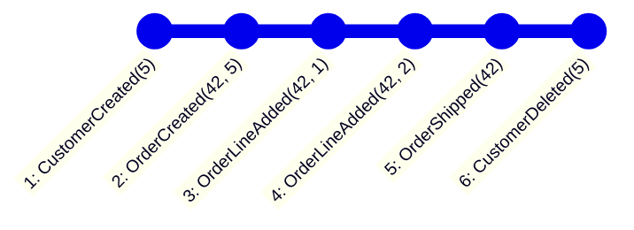
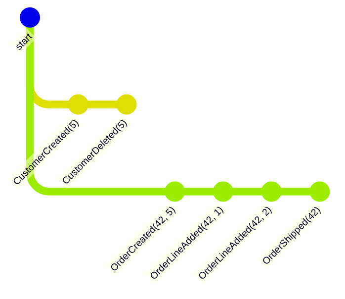
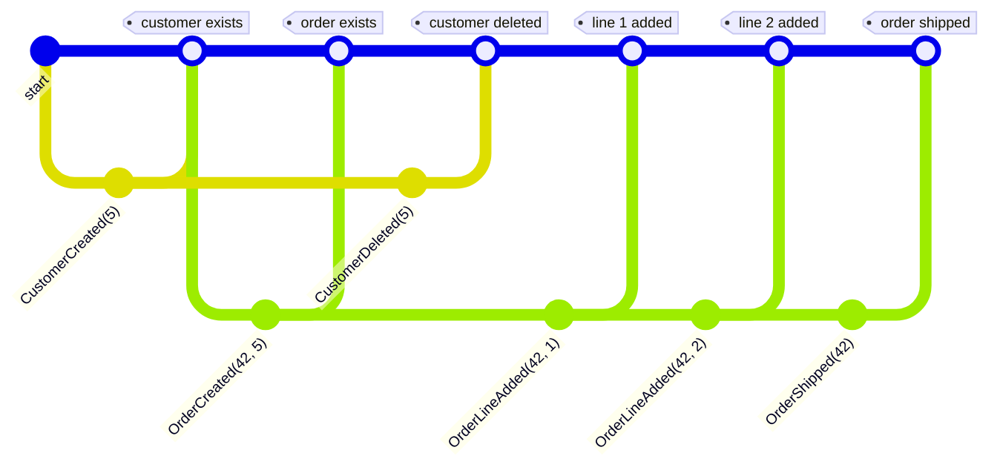

# Concurrency

When your [Event handlers]() are processing long streams of events you might want to have them processed concurrently to speed up the processing. This can be achieved by setting the `concurrency` -attribute on the processor.

Here are two examples: the "default" and a concurrent event-handler.

```csharp
[EventHandler("...")]
public class HandleSequentially
{
    public Task Handle(CustomerCreated e, EventContext ctx)
    {
        //..
    }

    public Task Handle(CustomerDeleted e, EventContext ctx)
    {
        //..
    }

}

[EventHandler(eventHandlerId: "...", concurrency: 100)]
public class HandleConcurrently
{
    public Task Handle(CustomerCreated e, EventContext ctx)
    {
        // ..
    }

    public Task Handle(CustomerDeleted e, EventContext ctx)
    {
        //..
    }
}
```

Both will handle the `CustomerCreated` and `CustomerDeleted` -events, and when the system is running normally they will perform very similarly. However, if there is a large back-log of unprocessed events (for example during a re-play or if the event-handler is new and has to process an existing stream of many events) the differences will show up.

### Sequential processing

This is the default. All the events in the stream will be processed in-order as they arrive. When running a re-play or with an existing stream of events the processing will happen one-by-one.

### Concurrent processing

The stream of events will be split up by the `EventSourceId` of the events, and up to 100 (in this case) of these will be processed concurrently. This means that an event-stream of a million events with a thousand different event-sources will be processed 100 at a time. There will be one event-handler -instance per event-source.

This leads to a dramatic increase in speed of processing large streams of events, but this has some consequences you need to be aware of when writing concurrent event-handlers.

## Beware

Your event-handler will no longer be a single processor moving along a stream of events, and this can give surprising results. You can no longer assume that something that happened "earlier" in the event-stream will have happened in your current handling-method, as it might still be waiting for processing on a different event-source-id. This introduces a dependency between the part of your system that inserts events (in particular the event-source and its Id), and the processing of these events.

### Example
Let's illustrate with an example.

We have created a system with customers and orders as different aggregates. We use a customer-number as the event-source-id for the customer, and the order-number as the event-source-id for the order.

We have an event-handler that handles `CustomerCreated`, `CustomerDeleted`, `OrderCreated` `OrderLineAdded` and `OrderShipped` -events.

```csharp
[AggregateRoot("...")]
public class Customer : AggregateRoot
{
    readonly CustomerNumber _id;

    public Customer(EventSourceId id) : base(id) => _id = id;

    public Create() => Apply(new CustomerCreated(_id));
    public Delete() => Apply(new CustomerDeleted(_id));
}

[AggregateRoot("...")]
public class Order : AggregateRoot
{
    readonly OrderNumber _id;

    public Order(EventSourceId id) : base(id) => _id = id;

    public Create(CustomerNumber c) => Apply(new OrderCreated(_id, c));
    public Add(OrderLine line) => Apply(new OrderLineAdded(_id, line)
    public Ship() => Apply(new OrderShipped(_id));
}
```

In our system we have the following event-stream for a customer 5, and order 42 with 2 lines:



Our event-handler that handles these sequentially will get the events in that order, and process them.
```csharp
[EventHandler("...")]
public class HandleSequentially
{
    public Task Handle(CustomerCreated e, EventContext ctx)
    {
        //..
    }

    public Task Handle(CustomerDeleted e, EventContext ctx)
    {
        //..
    }

    public Task Handle(OrderCreated e, EventContext ctx)
    {
        //..
    }

    public Task Handle(OrderLineAdded e, EventContext ctx)
    {
        //..
    }

    public Task Handle(OrderShipped e, EventContext ctx)
    {
        //..
    }
}
```

A concurrent event-handler will process each event-source-id concurrently, so the `CustomerCreated` and `CustomerDeleted` -events will be processed in order, and the `OrderCreated`, `OrderLineAdded` and `OrderShipped` -events will be processed in-order, but the ordering between these two event-source-ids is no longer guaranteed.

```csharp
[EventHandler("...", concurrency: 100)]
public class HandleConcurrentlyByEventSourceId
{
    public Task Handle(CustomerCreated e, EventContext ctx)
    {
        //..
    }

    public Task Handle(CustomerDeleted e, EventContext ctx)
    {
        //..
    }

    public Task Handle(OrderCreated e, EventContext ctx)
    {
        //..
    }

    public Task Handle(OrderLineAdded e, EventContext ctx)
    {
        //..
    }

    public Task Handle(OrderShipped e, EventContext ctx)
    {
        //..
    }
}

```



One possible actual ordering of these events as they run through your concurrently processing event-handler could be:



As you can see, the `CustomerDeleted` -event is processed before the `OrderLineAdded` -events. If the handle-method for `OrderLineAdded` -event needs to access the customer, it will not be able to do so, as the customer has been deleted. The same is true for the `OrderShipped` -event, it might also need to access the customer, and it will not be able to do so.

Is this a good thing, is it even acceptable? That is up to you to decide. It is important to be aware of this, and to design your system accordingly.

If your processing exists to create an order-page for the customer, having the customer deletion happen before all the order-events might be a good thing, as you know this customer will end up deleting their account and you do not need to create a page that will never be shown. However, you need to be aware of it, and make sure that the handler does not crash when the customer has been deleted.

## Mitigation

Concurrency adds complexity to your system, and you need to be aware of this complexity and design your system accordingly. There are ways to mitigate this complexity.

### Option 1 - don't use concurrency
The simplest way to mitigate this is to not use concurrent event-handlers. If you do not need the performance boost, or if you do not want to deal with the complexity of concurrent processing, just use sequential processing.

### Option 2 - use the same EventSourceId
If you need to use concurrency the best way to deal with them is to have the same `EventSourceId` for the events that you want guarantee the ordering of. In the example above, if we want to guarantee that the `OrderCreated`, `OrderLineAdded` and `OrderShipped` -events are processed in-order, we can use the `CustomerId` as the `EventSourceId` for all of them.

In fact the events need not come from the same event-source, as long as they have the same `EventSourceId` they will be processed in-order.

```csharp
[AggregateRoot("...")]
public class Customer : AggregateRoot
{
    readonly CustomerNumber _id;

    public Customer(EventSourceId id) : base(id) => _id = id;

    public Create() => Apply(new CustomerCreated(_id));
    public Delete() => Apply(new CustomerDeleted(_id));
}

[AggregateRoot("...")]
public class CustomerOrders : AggregateRoot
{
    readonly CustomerNumber _customerNumber;
    readonly OrderNumber _orderNumber;

    public Order(EventSourceId customerNumber) : base(customerNumber) => _customerId = id;

    public Create(OrderId o) => Apply(new OrderCreated(_orderNumber, _customerNumber));
    public Add(OrderLine line) => Apply(new OrderLineAdded(_orderNumber, line)
    public Ship() => Apply(new OrderShipped(_orderNumber));

    void On(OrderCreated e) => _orderNumber = e.OrderId;
}
```

### Option 3 - consolidate to a single aggregate

You could put the orders into the customer -aggregate to guarantee that they are processed in-order.

```csharp
[AggregateRoot("...")]
public class Customer : AggregateRoot
{
    readonly CustomerNumber _id;
    readonly List<Order> _orders = new List<Order>();

    public Customer(EventSourceId id) : base(id) => _id = id;

    public Create() => Apply(new CustomerCreated(_id));
    public Delete() => Apply(new CustomerDeleted(_id));

    public CreateOrder(OrderNumber o) => Apply(new OrderCreated(_id));

    public AddOrderLine(OrderNumber o, OrderLine line) =>
        _orders.Any(o => o.Number == o)
            ? Apply(new OrderLineAdded(_id, line)
            : throw new InvalidOperationException("Order does not exist");

    public ShipOrder(OrderNumber o) =>
        _orders.Single(o => o.Number == o).Shipped == false
            ? Apply(new OrderShipped(_id))
            : throw new InvalidOperationException("Order already shipped");

    void On(OrderCreated e) => _orders.Add(new Order(e.OrderId));
    void On(OrderLineAdded e) => _orders.Single(o => o.Id == e.OrderId).AddLine(e.Line);
    void On(OrderShipped e) => _orders.Single(o => o.Id == e.OrderId).Ship();

    class Order
    {
        public OrderNumber Number { get; init; }
        public bool Shipped { get; private set; } = false
        readonly List<OrderLine> _lines = new List<OrderLine>();

        public Order(OrderNumber number) => _number = number;

        public AddLine(OrderLine line) => _lines.Add(line);
        public Ship() => Shipped  = true;
    }
}
```

### Option 4 - defensive handling

When you write your event-handlers you may be able to write them such that they can handle the events out of order, or at least only guaranteed in-order within an event-source. This is not always possible, but if it is, it is a good way to mitigate the complexity of concurrent processing.

This depends on what you do in your handler. If you are storing a read-model you may have to deal with partial or missing data, if you are calling on external services you might have to deal with them being unavailable, or not supporting the order in which you are calling them.


## Conclusion

Activating concurrency can lead to great performance improvements, but it comes at a cost. To safely use concurrency you should be aware of the implications of concurrent processing, and design your system accordingly.
