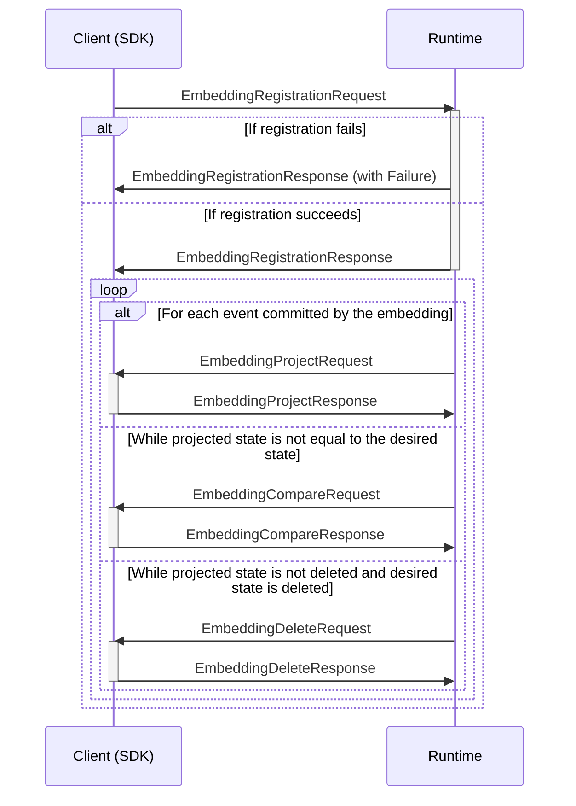
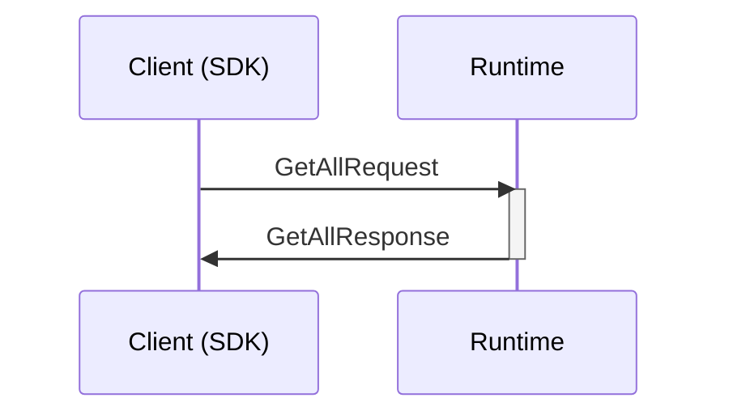

## Register Embedding

Registers a callback-type embedding, to create events from changes to a read model in an external system. The Runtime will call the client with read model states to compare and the client returns events that capture the differences. The Runtime will then call the client again with these events to update the internal state.




### Registration message types

```mermaid
classDiagram
    class EmbeddingRegistrationRequest{
        ReverseCallArgumentsContext callContext
        Uuid embeddingId
        Artifact[] events
        string initialState
    }
    class EmbeddingRegistrationResponse{
        Failure failure
    }
    %%
    EmbeddingRegistrationRequest --* ReverseCallArgumentsContext
    EmbeddingRegistrationRequest --* Artifact
    EmbeddingRegistrationResponse --o Failure
    %% links
    link ReverseCallArgumentsContext "" "Types"
    link Artifact "" "Types"
    link Failure "" "Types"
```

### Event message types

```mermaid
classDiagram
    class EmbeddingProjectRequest{
        ReverseCallRequestContext callContext
        UncommittedEvent event
        ProjectionCurrentState currentState
    }
    class EmbeddingProjectResponse{
        ReverseCallResponseContext callContext
        EmbeddingProjectResponseAction response
        ProcessorFailure failure
    }
    class EmbeddingProjectResponseAction{
        <<abstract>>
    }
    class EmbeddingCompareRequest{
        ReverseCallRequestContext callContext
        ProjectionCurrentState projectionState
        string entityState
    }
    class EmbeddingCompareResponse{
        ReverseCallResponseContext callContext
        UncommittedEvent[] event
    }
    class EmbeddingDeleteRequest{
        ReverseCallRequestContext callContext
        ProjectionCurrentState projectionState
    }
    class EmbeddingDeleteResponse{
        ReverseCallResponseContext callContext
        UncommittedEvent[] event
    }
    %%
    EmbeddingProjectRequest --* ReverseCallRequestContext
    EmbeddingProjectRequest --* ProjectionCurrentState
    EmbeddingProjectRequest --* UncommittedEvent
    EmbeddingProjectResponse --* ReverseCallResponseContext
    EmbeddingProjectResponse --* EmbeddingProjectResponseAction
    EmbeddingProjectResponse --* ProcessorFailure
    ProjectionReplaceResponse ..|> EmbeddingProjectResponseAction
    ProjectionDeleteResponse ..|> EmbeddingProjectResponseAction
    EmbeddingCompareRequest --* ReverseCallRequestContext
    EmbeddingCompareRequest --* ProjectionCurrentState
    EmbeddingCompareResponse --* ReverseCallResponseContext
    EmbeddingCompareResponse --* UncommittedEvent
    EmbeddingDeleteRequest --* ReverseCallRequestContext
    EmbeddingDeleteResponse --* ReverseCallResponseContext
    EmbeddingDeleteRequest --* ProjectionCurrentState
    EmbeddingDeleteResponse --* UncommittedEvent
    %% links
    link ReverseCallRequestContext "" "Types"
    link ReverseCallResponseContext "" "Types"
    link ProcessorFailure "" "Types"
    link UncommittedEvent "" "Event Store"
    link ProjectionCurrentState "" "Projections"
    link ProjectionReplaceResponse "" "Projections"
    link ProjectionDeleteResponse "" "Projections"
```

## Compare Embedding by key

Triggers a comparison for the specified embedding and its unique key - for one tenant. The Runtime will call the embedding to compare the internal and desired state, and return events to commit, which in turn will update the internal state. The Runtime will reply with success if the embedding read model reached the desired state, or failure if it was impossible to reach the desired state.


## Delete Embedding by key

Triggers a delete request for the specified embedding and its unique key - for one tenant. The Runtime will call the embedding to delete the internal state, and return events to commit, which in turn will delete the internal state. The Runtime will reply with success if the embedding  read model was deleted, or failure if it was impossible to delete.


## Get one Embeddding by key

Retrieves an instance of the internal read model for a specified embedding and its unique key - for one tenant. If the instance does not exist, the  Runtime will reply with the initial state for the embedding.


### Message types

```mermaid
classDiagram
    class GetOneRequest{
        CallRequestContext callContext
        Uuid scopeId
        Uuid projectionId
        string key
    }
    class GetOneResponse{
        Failure? failure
        ProjectionCurrentState currentState
    }
    %%
    GetOneRequest --* CallRequestContext
    GetOneResponse --* ProjectionCurrentState
    GetOneResponse --* Failure
    %% links
    link ProjectionCurrentState "" "Types"
    link CallRequestContext "" "Types"
    link Failure "" "Types"
```

## Get all Embeddings

Retrieves all instances of internal read models for a specified embedding - for one tenant.



### Message types

```mermaid
classDiagram
    class GetAllRequest{
        CallRequestContext callContext
        Uuid scopeId
        Uuid projectionId
    }
    class GetAllResponse{
        Failure? failure
        ProjectionCurrentState[] currentState
    }
    %%
    GetAllRequest --* CallRequestContext
    GetAllResponse --* ProjectionCurrentState
    GetAllResponse --* Failure
    %% links
    link ProjectionCurrentState "" "Types"
    link CallRequestContext "" "Types"
    link Failure "" "Types"
```

## Get all Embedding keys

Retrieves all internal read model keys for a specified embedding - for one tenant.
