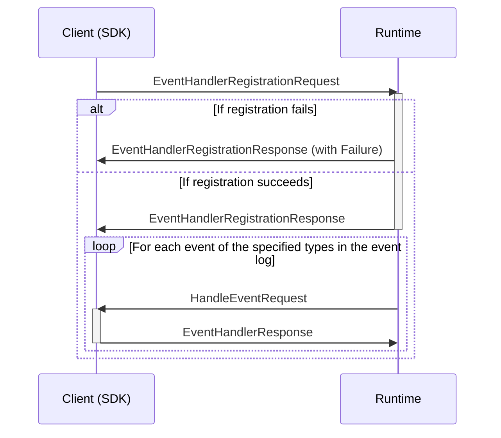

## Register Event Handler

Registers a callback-type event handler, to perform an action on specified event types from (all tenants) event log. The Runtime will call the client with events of the specified types to perform some action.




### Registration message types

```mermaid
classDiagram
    class EventHandlerRegistrationRequest{
        ReverseCallArgumentsContext callContext
        Uuid scopeId
        Uuid eventHandlerId
        Artifact[] types
        bool partitioned
    }
    class EventHandlerRegistrationResponse{
        Failure failure
    }
    %%
    EventHandlerRegistrationRequest --* ReverseCallArgumentsContext
    EventHandlerRegistrationRequest --* Artifact
    EventHandlerRegistrationResponse --o Failure
    %% links
    link ReverseCallArgumentsContext "" "Types"
    link Artifact "" "Types"
    link Failure "" "Types"
```

### Event message types

```mermaid
classDiagram
    class HandleEventRequest{
        ReverseCallRequestContext callContext
        StreamEvent event
        RetryProcessingState retryProcessingState
    }
    class EventHandlerResponse{
        ReverseCallResponseContext callContext
        ProcessorFailure failure
    }
    %%
    HandleEventRequest --* ReverseCallRequestContext
    HandleEventRequest --* StreamEvent
    HandleEventRequest --* RetryProcessingState
    EventHandlerResponse --* ReverseCallResponseContext
    EventHandlerResponse --* ProcessorFailure
    %% links
    link ReverseCallRequestContext "" "Types"
    link ReverseCallResponseContext "" "Types"
    link RetryProcessingState "" "Types"
    link ProcessorFailure "" "Types"
    link StreamEvent "" "Event Store"
```
