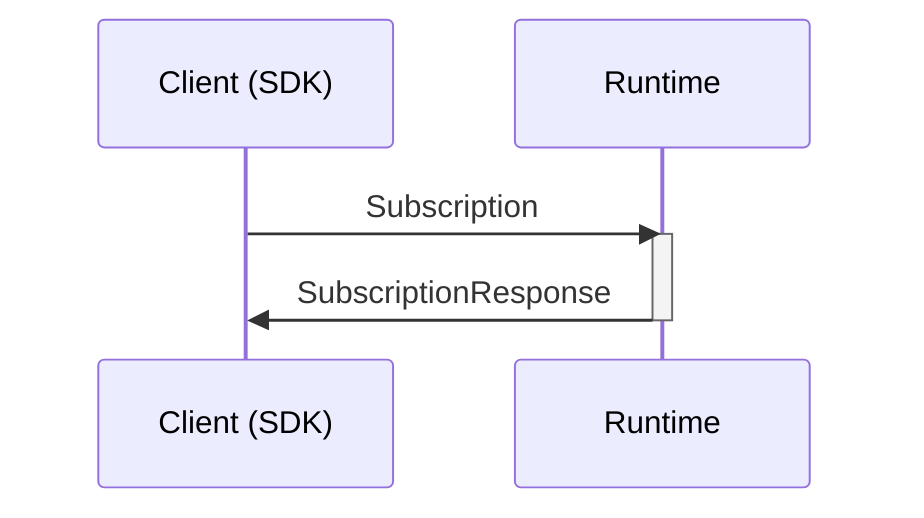

## Subscribe to a public stream in another microservice

Requests the Runtime to setup a subscription, to receive a copy of all events from a public stream (can be multiple types) of a tenant in another microservice, and put them in a scoped event log for the calling tenant. If allowed, the Runtime will continue doing this until restarted.



### Message types

```mermaid
classDiagram
    class Subscription{
        CallRequestContext callContext
        Uuid microserviceId
        Uuid tenantId
        Uuid streamId
        Uuid partitionId
        Uuid scopeId
    }
    class SubscriptionResponse{
        Failure failure
        Uuid consentId
    }
    %%
    Subscription --* CallRequestContext
    SubscriptionResponse --* Failure
    %% links
    link CallRequestContext "" "Types"
    link Failure "" "Types"
```
