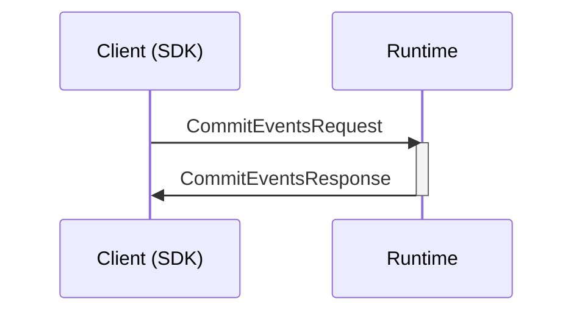
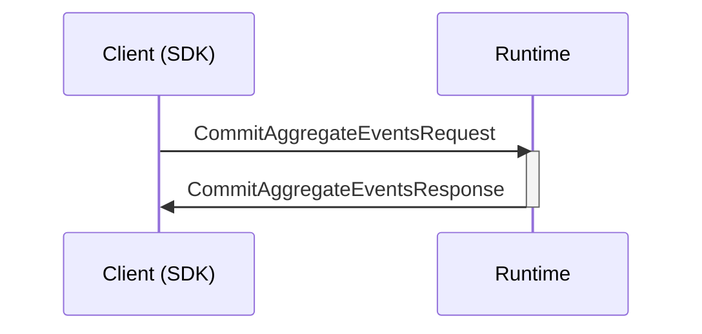
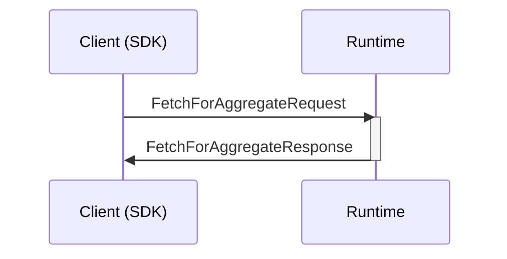

## Commit events

Appends the provided events to the end of the (a tenant) event log.




### Message types

```mermaid
classDiagram
    %% commit events
    class CommitEventsRequest{
        CallRequestContext callContext
        UncommittedEvent[] events
    }
    class UncommittedEvent{
        string content
        Artifact artifact
        Uuid eventSourceId
        bool public
    }
    class CommitEventsResponse{
        Failure? failure
        CommittedEvent[] events
    }
    class CommittedEvent{
        string content
        Artifact type
        Uuid eventSourceId
        bool public
        ulong eventLogSequenceNumber
        Timestamp occurred
        ExecutionContext executionContext
        bool external
        ulong? externalEventLogSequenceNumber
        Timestamp? externalEventReceived
    }
    %%
    CommitEventsRequest --* CallRequestContext
    CallRequestContext --o ExecutionContext
    CommitEventsRequest --o "*" UncommittedEvent
    UncommittedEvent --o Artifact
    CommitEventsResponse --* Failure
    CommitEventsResponse --o CommittedEvent
    CommittedEvent --o Artifact
    %% links
    link CallRequestContext "" "Types"
    link ExecutionContext "" "Types"
    link Artifact "" "Types"
    link Failure "" "Types"
```

## Commit aggregate events

Appends the provided events to the end of the (a tenant) event log - but also checks that no events have been committed to the aggregate root since the corresponding "Fetch Aggregate Events", and increments the aggregate root version




### Message types

```mermaid
classDiagram
    %% commit aggregate event
    class CommitAggregateEventsRequest{
        CallRequestContext callContext
        UncommittedAggregateEvents events
    }
    class UncommittedAggregateEvents{
        Uuid aggregateRootId
        Uuid eventSourceId
        uing64 expectedAggregateRootVersion
        UncommittedAggregateEvent[] events
    }
    class UncommittedAggregateEvent{
        string content
        Artifact artifact
        bool public
    }
    class CommitAggregateEventsResponse{
        Failure failure
        CommittedAggregateEvents events
    }
    class CommittedAggregateEvents{
        Uuid aggregateRootId
        Uuid eventSourceId
        uing64 aggregateRootVersion
        CommittedAggregateEvent[] events
    }
    class CommittedAggregateEvent{
        ulong eventLogSequenceNumber
        Timestamp occurred
        ExecutionContext executionContext
        Artifact type
        bool public
        string content
    }
    %%
    CommitAggregateEventsRequest --* UncommittedAggregateEvents
    UncommittedAggregateEvents --* UncommittedAggregateEvent
    CommitAggregateEventsResponse --* Failure
    CommitAggregateEventsResponse --* CommittedAggregateEvents
    CommittedAggregateEvents --* CommittedAggregateEvent
    CommittedAggregateEvent --o Artifact
    UncommittedAggregateEvent --o Artifact
    CommitAggregateEventsRequest --* CallRequestContext
    CommittedAggregateEvent --o ExecutionContext
    CallRequestContext --o ExecutionContext
    %% links
    link Failure "" "Types"
    link Artifact "" "Types"
    link CallRequestContext "" "Types"
    link ExecutionContext "" "Types"
```

## Fetch aggregate events

Gets all the events from the (a tenant) event log that have been committed by a specific aggregate root - and the aggregate root version.



### Message types

```mermaid
classDiagram
    class CommittedAggregateEvents{
        Uuid aggregateRootId
        Uuid eventSourceId
        uing64 aggregateRootVersion
        CommittedAggregateEvent[] events
    }
    class CommittedAggregateEvent{
        ulong eventLogSequenceNumber
        Timestamp occurred
        ExecutionContext executionContext
        Artifact type
        bool public
        string content
    }
    %% fetch aggregate events
    class FetchForAggregateRequest{
        CallRequestContext callContext
        Aggregate aggregate
    }
    class Aggregate{
        Uuid aggregateRootId
        Uuid eventSourceId
    }
    class FetchForAggregateResponse{
        Failure? failure
        CommittedAggregateEvents events
    }
    %%
    FetchForAggregateRequest --* Aggregate
    CommittedAggregateEvents --* CommittedAggregateEvent
    FetchForAggregateRequest --* CallRequestContext
    CommittedAggregateEvent --o Artifact
    CommittedAggregateEvent --o ExecutionContext
    FetchForAggregateResponse --* Failure
    FetchForAggregateResponse --* CommittedAggregateEvents
    %% links
    link CallRequestContext "" "Types"
    link ExecutionContext "" "Types"
    link Artifact "" "Types"
    link Failure "" "Types"
```
