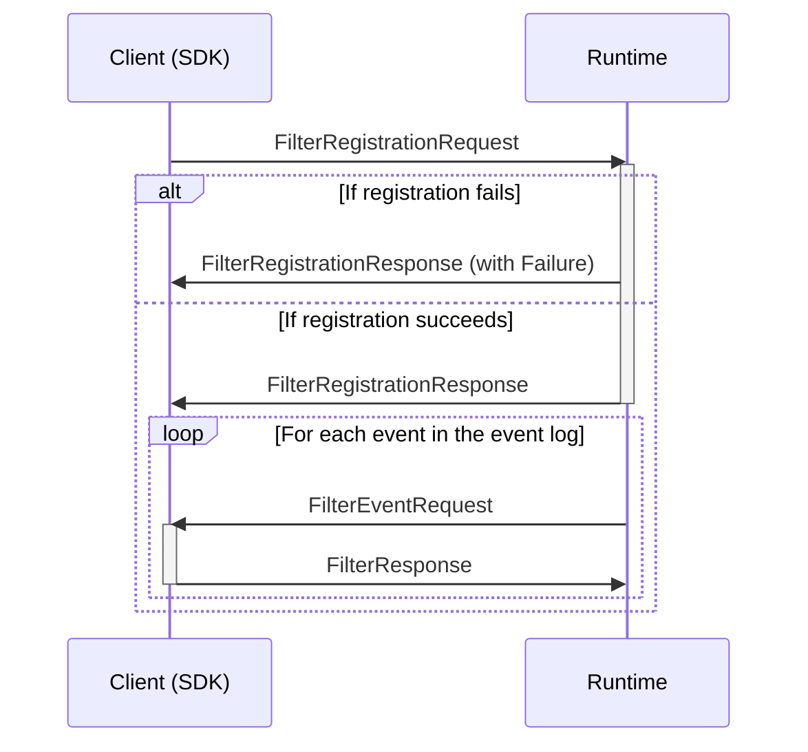
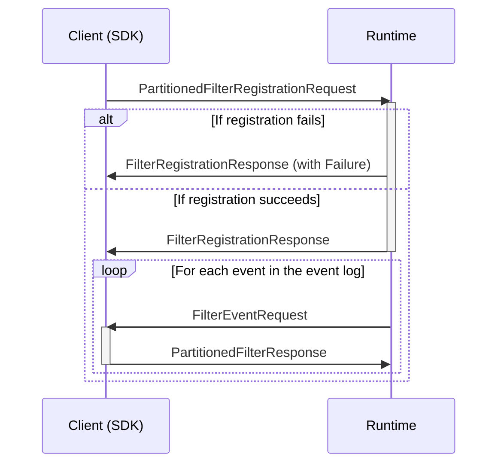
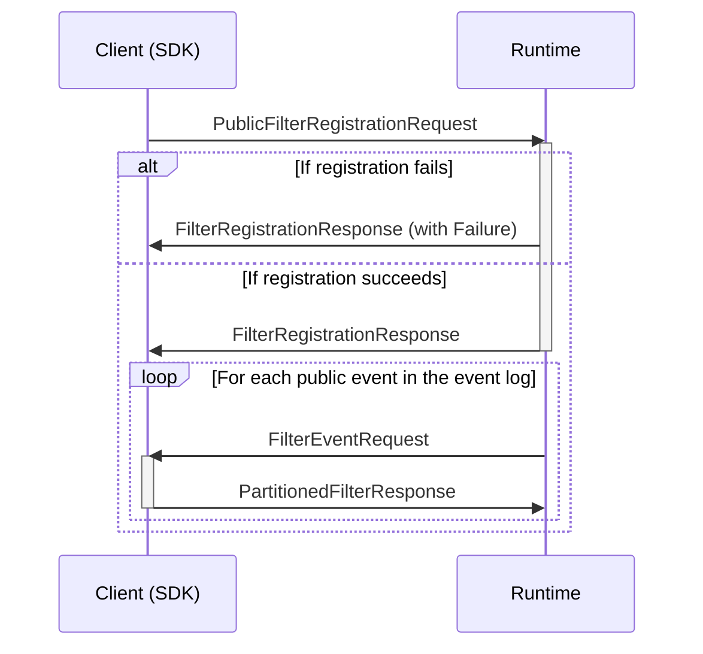

## Register Unpartitioned Private Filter

Registers an unpartitioned callback-type filter, to filter events from the (all tenants) event log to a stream. The runtime will call the client with events to decide if they should be in the stream.




### Registration message types

```mermaid
classDiagram
    class FilterRegistrationRequest{
        ReverseCallArgumentsContext callContext
        Uuid scopeId
        Uuid filterId
    }
    class FilterRegistrationResponse{
        Failure failure
    }
    %%
    FilterRegistrationRequest --* ReverseCallArgumentsContext
    FilterRegistrationResponse --o Failure
    %% links
    link ReverseCallArgumentsContext "" "Types"
    link Failure "" "Types"
```

### Event message types

```mermaid
classDiagram
    class FilterEventRequest{
        ReverseCallRequestContext callContext
        CommittedEvent event
        Uuid scopeId
        RetryProcessingState retryProcessingState
    }
    class FilterResponse{
        ReverseCallResponseContext callContext
        bool isIncluded
        ProcessorFailure failure
    }
    %%
    FilterEventRequest --* ReverseCallRequestContext
    FilterEventRequest --* CommittedEvent
    FilterEventRequest --* RetryProcessingState
    FilterResponse --* ReverseCallResponseContext
    FilterResponse --* ProcessorFailure
    %% links
    link ReverseCallRequestContext "" "Types"
    link ReverseCallResponseContext "" "Types"
    link RetryProcessingState "" "Types"
    link ProcessorFailure "" "Types"
    link CommittedEvent "" "Event Store"
```

## Register Partitioned Private Filter

Registers a partitioned callback-type filter, to filter events from the (all tenants) event log to a stream. The runtime will call the client with events to decide if they should be in the stream, and in what partition.




### Registration message types

```mermaid
classDiagram
    class PartitionedFilterRegistrationRequest{
        ReverseCallArgumentsContext callContext
        Uuid scopeId
        Uuid filterId
    }
    class FilterRegistrationResponse{
        Failure failure
    }
    %%
    PartitionedFilterRegistrationRequest --* ReverseCallArgumentsContext
    FilterRegistrationResponse --o Failure
    %% links
    link ReverseCallArgumentsContext "" "Types"
    link Failure "" "Types"
```

### Event message types

```mermaid
classDiagram
    class FilterEventRequest{
        ReverseCallRequestContext callContext
        CommittedEvent event
        Uuid scopeId
        RetryProcessingState retryProcessingState
    }
    class PartitionedFilterResponse{
        ReverseCallResponseContext callContext
        bool isIncluded
        Uuid partition
        ProcessorFailure failure
    }
    %%
    FilterEventRequest --* ReverseCallRequestContext
    FilterEventRequest --* CommittedEvent
    FilterEventRequest --* RetryProcessingState
    PartitionedFilterResponse --* ReverseCallResponseContext
    PartitionedFilterResponse --* ProcessorFailure
    %% links
    link ReverseCallRequestContext "" "Types"
    link ReverseCallResponseContext "" "Types"
    link RetryProcessingState "" "Types"
    link ProcessorFailure "" "Types"
    link CommittedEvent "" "Event Store"
```

## Register Public Filter 

Registers a partitioned callback-type filter, to filter public events from the (all tenants) event log to a public stream. The runtime will call the client with public events to decide if they should be in the stream, and in what partition.



### Registration message types

```mermaid
classDiagram
    class PublicFilterRegistrationRequest{
        ReverseCallArgumentsContext callContext
        Uuid filterId
    }
    class FilterRegistrationResponse{
        Failure failure
    }
    %%
    PublicFilterRegistrationRequest --* ReverseCallArgumentsContext
    FilterRegistrationResponse --o Failure
    %% links
    link ReverseCallArgumentsContext "" "Types"
    link Failure "" "Types"
```

### Event message types

```mermaid
classDiagram
    class FilterEventRequest{
        ReverseCallRequestContext callContext
        CommittedEvent event
        Uuid scopeId
        RetryProcessingState retryProcessingState
    }
    class PartitionedFilterResponse{
        ReverseCallResponseContext callContext
        bool isIncluded
        Uuid partition
        ProcessorFailure failure
    }
    %%
    FilterEventRequest --* ReverseCallRequestContext
    FilterEventRequest --* CommittedEvent
    FilterEventRequest --* RetryProcessingState
    PartitionedFilterResponse --* ReverseCallResponseContext
    PartitionedFilterResponse --* ProcessorFailure
    %% links
    link ReverseCallRequestContext "" "Types"
    link ReverseCallResponseContext "" "Types"
    link RetryProcessingState "" "Types"
    link ProcessorFailure "" "Types"
    link CommittedEvent "" "Event Store"
```
