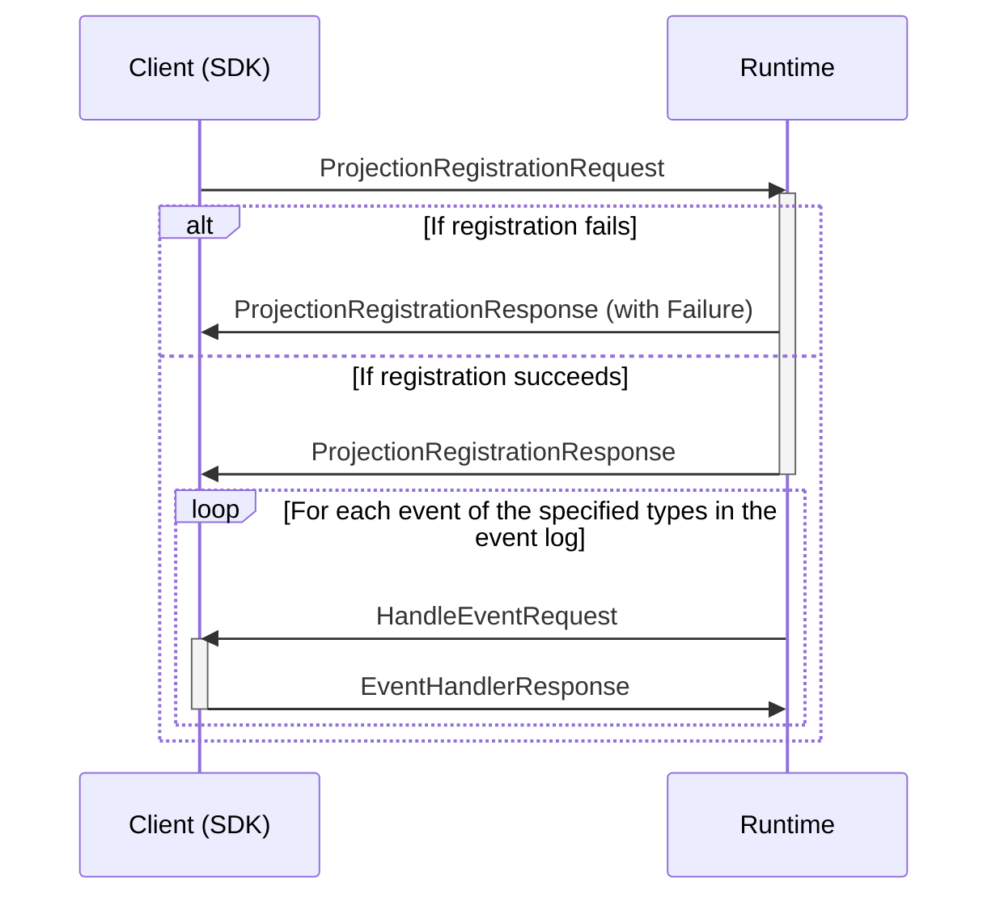
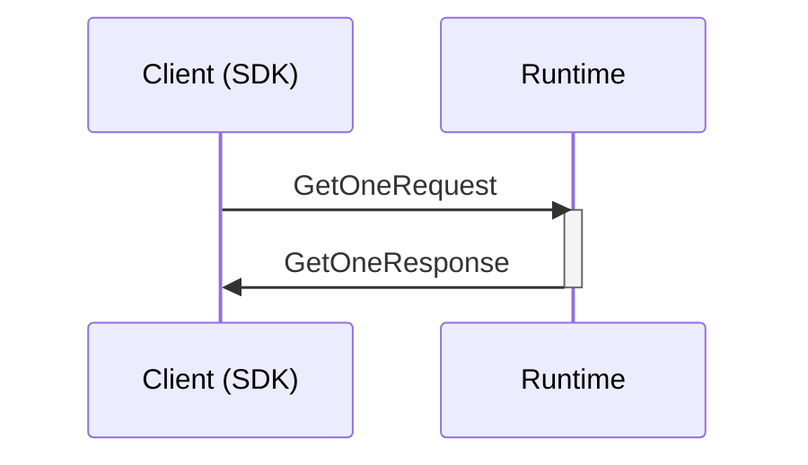
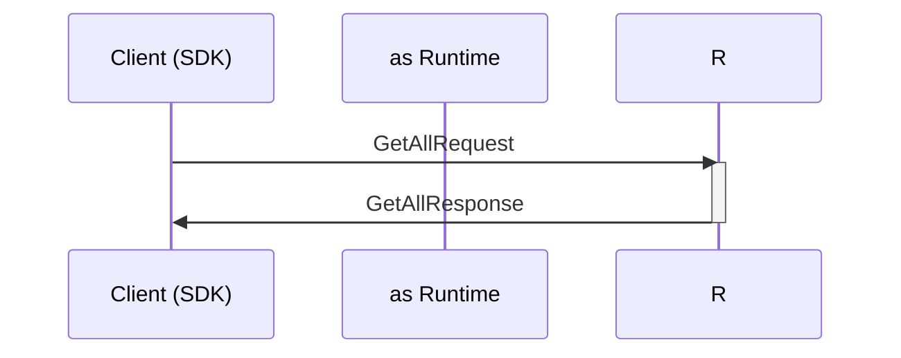

## Register Projection

Registers a callback-type projection, to build a read model from specified event types from (all tenants) event log. The Runtime will call the client with events of the specified types and the current read model state. The client returns the updated state, that will be stored in the projection store.




### Registration message types

```mermaid
classDiagram
    class ProjectionRegistrationRequest{
        ReverseCallArgumentsContext callContext
        Uuid scopeId
        Uuid projectionId
        ProjectionEventSelector[] events
    }
    class ProjectionRegistrationResponse{
        Failure failure
    }
    class ProjectionEventSelector{
        <<abstract>>
        Artifact eventType
    }
    class EventSourceIdKeySelector{  
    }
    class PartitionIdKeySelector{
    }
    class EventPropertyKeySelector{
        string propertyName
    }
    %%
    ProjectionRegistrationRequest --* ReverseCallArgumentsContext
    ProjectionRegistrationRequest --* ProjectionEventSelector
    ProjectionEventSelector --* Artifact
    EventSourceIdKeySelector ..|> ProjectionEventSelector
    PartitionIdKeySelector ..|> ProjectionEventSelector
    EventPropertyKeySelector ..|> ProjectionEventSelector
    ProjectionRegistrationResponse --o Failure
    %% links
    link ReverseCallArgumentsContext "" "Types"
    link Artifact "" "Types"
    link Failure "" "Types"
```

### Event message types

```mermaid
classDiagram
    class HandleEventRequest{
        ReverseCallRequestContext callContext
        StreamEvent event
        RetryProcessingState retryProcessingState
    }
    class EventHandlerResponse{
        ReverseCallResponseContext callContext
        ProcessorFailure failure
    }
    %%
    HandleEventRequest --* ReverseCallRequestContext
    HandleEventRequest --* StreamEvent
    HandleEventRequest --* RetryProcessingState
    EventHandlerResponse --* ReverseCallResponseContext
    EventHandlerResponse --* ProcessorFailure
    %% links
    link ReverseCallRequestContext "" "Types"
    link ReverseCallResponseContext "" "Types"
    link RetryProcessingState "" "Types"
    link ProcessorFailure "" "Types"
    link StreamEvent "" "Event Store"
```

## Get one ReadModel by key

Retrieves an instance of a read model for a specified projection and its unique key - for one tenant. If the instance does not exist, the Runtime will reply with the initial state for the projection.



### Event Message types

## Get all ReadModels

Retrieves all instances of a read model for a specified projection - for one tenant.


### Event Message types
