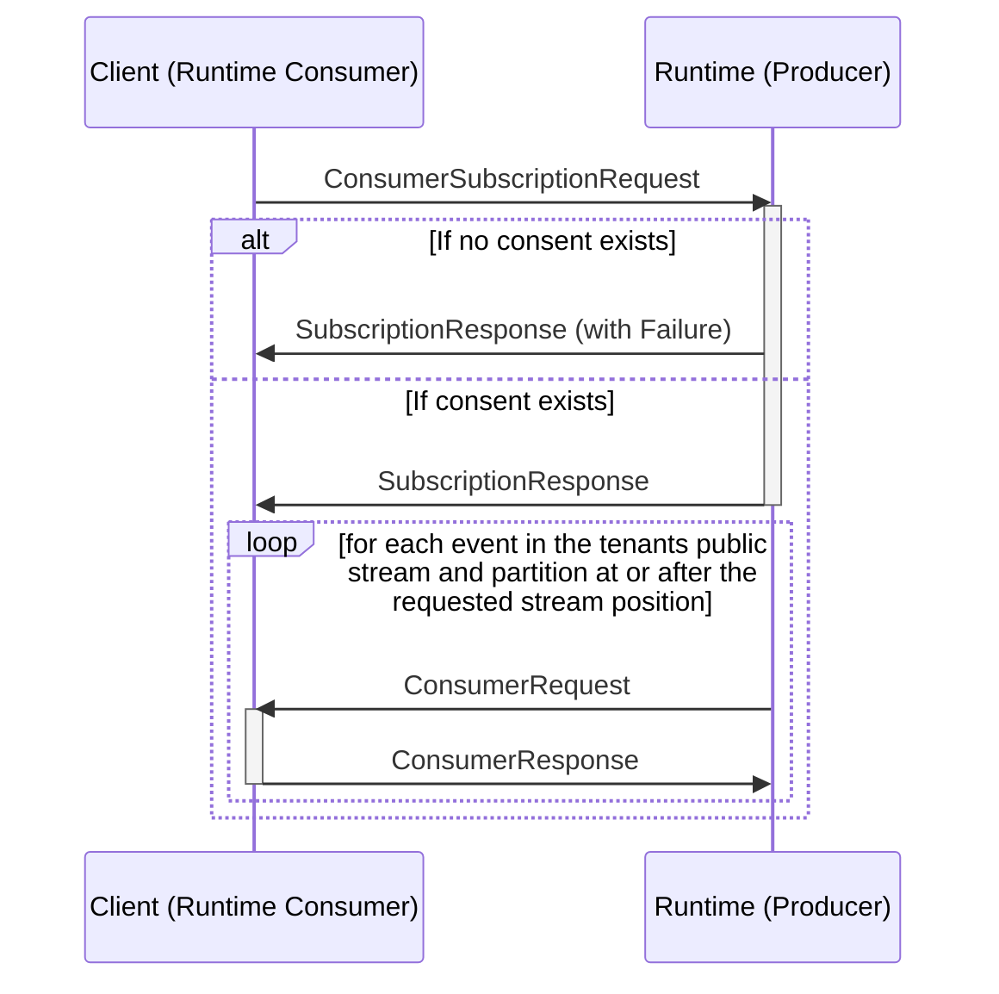

## Get Events from public stream

Get all events (can be multiple types) from a partition in a public stream of a tenant. The Runtime will call the client with the events in the specified stream, to store a copy in a scoped event log.




### Registration message types

```mermaid
classDiagram
    class ConsumerSubscriptionRequest{
        ReverseCallArgumentsContext callContext
        Uuid tenantId
        Uuid streamId
        Uuid partitionId
        uint64 streamPosition
    }
    class SubscriptionResponse{
        Failure failure
        Uuid consentId
    }
    %%
    ConsumerSubscriptionRequest --* ReverseCallArgumentsContext
    SubscriptionResponse--o Failure
    %% links
    link ReverseCallArgumentsContext "" "Types"
    link Failure "" "Types"
```

### Event message types

```mermaid
classDiagram
    class ConsumerRequest{
        ReverseCallRequestContext callContext
        EventHorizonEvent event
    }
    class EventHorizonEvent{
        uint64 streamSequenceNumber
        CommittedEvent event
    }
    class ConsumerResponse{
        ReverseCallResponseContext callContext
        bool isIncluded
        ProcessorFailure failure
    }
    %%
    ConsumerRequest --* EventHorizonEvent
    ConsumerRequest --* ReverseCallRequestContext
    EventHorizonEvent --* CommittedEvent
    ConsumerResponse --* ReverseCallResponseContext
    ConsumerResponse --* ProcessorFailure
    %% links
    link ReverseCallRequestContext "" "Types"
    link ReverseCallResponseContext "" "Types"
    link ProcessorFailure "" "Types"
    link CommittedEvent "" "Event Store"
```
